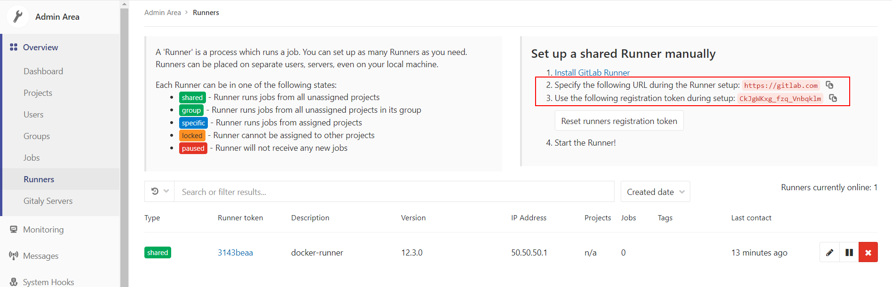

# Gitlab Runner with docker-compose

Gitlab runner easily explained and dockerized with compose.

**Take the time to read this documentation to understand how runners work.**

## Principle

A _runner_ is an external machine or VM on which Gitlab pipelines will be executed once the machine has been registered.

Your runner machine is a standalone machine that will automatically be ping by Gitlab, clone your project and execute a serie of test as described by your `gitlab-ci.yml` file or through the _Auto DevOps_ feature of Gitlab.

So we have two things to do :
1. Create the runner server
2. Register the runner to your Gitlab instance

## Installation

We will need two information first :
- Your Gitlab instance URL (e.g: https://gitlab.com/)
- A Gitlab Runner token

### Getting your Gitlab Runner token

You have `system-wide` or `group-wide` Runner tokens.

If you want your Runner to run pipelines for any project, go to the `Admin Area > Overview > Runners` (/admin/runners).



If you want your Runner to run pipelines for only a specific project, go to `Your Project > Settings > CI / CD` and expand the `Runners` tab.


There, get your **token** and **URL**.

### Specify tags (optional)

You can tag `jobs` and `runners` so only runners with the specific tags of the job will run your pipeline

To tag a specific job, go to your `gitlab-ci.yml` file and edit the `tags` attribute of your job.

For example like that :
```yml
windows job:
  stage:
    - build
  tags:
    - windows
    - greetings
    - example_scripts
  script:
    - echo Hello, %USERNAME%!

osx job:
  stage:
    - build
  tags:
    - osx
  script:
    - echo "Hello, $USER!"
```

In `entrypoint.sh`, edit the `--tag-list` flag to add Runner tags.

### Edit entrypoint.sh

Open `entrypoint.sh` and edit the options `--url`, `--description` (optional) and `--registration-token`